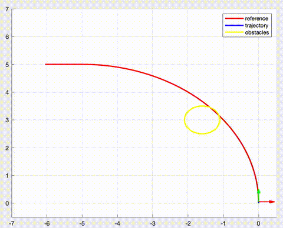
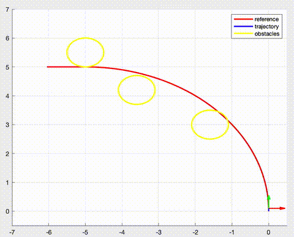

# Planar Quadcopter MPC with Control Barrier Functions

This repository contains MATLAB code for Model Predictive Control (MPC) of a **planar quadcopter** system with **Control Barrier Functions (CBFs)** for obstacle avoidance in **sampled-data systems**. The controller ensures safety using a **higher-order CBF** formulation tailored for systems where control inputs appear at higher derivatives.

## Demo

### One Obstacle
<p align="center">
  
</p>

### Two Obstacles
<p align="center">
  
</p>

### Three Obstacles
<p align="center">
  
</p>

---

## System Description

The planar quadcopter can be modelled as:

**State vector:**
$$
\mathbf{x} = [x, \dot{x}, y, \dot{y}, \phi, \dot{\phi}, \theta, \dot{\theta}]^\top
$$

**Control input vector:**
$$
\mathbf{u} = [\tau_\phi, \tau_\theta]^\top
$$


**System Dynamics:**
$$
\begin{aligned}
\ddot{x} &= g \theta \\
\ddot{y} &= -g \phi \\
\ddot{\phi} &= \frac{\tau_\phi}{I_x} \\
\ddot{\theta} &= \frac{\tau_\theta}{I_y}
\end{aligned}
$$

**Where:**
- $x, y$: horizontal and vertical positions of the quadcopter
- $\dot{x}, \dot{y}$: linear velocities in the $x$ and $y$ directions
- $\phi, \theta$: roll and pitch angles  
- $\dot{\phi}, \dot{\theta}$: angular velocities of roll and pitch
- $I_x, I_y$: moments of inertia around the roll and pitch axes  
- $g$: gravity
- $\tau_\phi, \tau_\theta$: torques applied about the roll and pitch axes 

---

## MPC Optimization Problem

At each timestep, the MPC solves the following finite-horizon constrained optimization:

$$
\begin{aligned}
\min_{\mathbf{u}_{0:N-1}} \quad & \sum_{k=0}^{N-1} \left\| \mathbf{x}_k - \mathbf{x}_{\text{ref},k} \right\|_Q^2 + \left\| \mathbf{u}_k \right\|_R^2 \\
\text{s.t.} \quad & \mathbf{x}_{k+1} = f_d(\mathbf{x}_k, \mathbf{u}_k), \quad k = 0, \dots, N-1 \quad \text{(Discrete dynamics)} \\
& h^{(4)}(\mathbf{x}_k, \mathbf{u}_k) + \alpha_3 h^{(3)} + \alpha_2 h^{(2)} + \alpha_1 \dot{h} + \alpha_0 h(\mathbf{x}_k) \geq \delta, \quad \text{(HOCBF)} \\
& \mathbf{u}_{\min} \leq \mathbf{u}_k \leq \mathbf{u}_{\max}, \quad \text{(Actuation constraints)}
\end{aligned}
$$

Where:
- $f_d$ is the **discretized dynamics** function,
- $h(\mathbf{x}) = (p_x - x_c)^2 + (p_y - y_c)^2 - r^2$ is the **control barrier function**,
- $h^{(i)}$ denotes the $i$-th time derivative of $h$,
- $\delta > 0 $ is a safety margin to account for **discretization (i.e., sampled-data)**,
- $Q, R$ are positive semi-definite weighting matrices for tracking and effort,
- $\alpha_i > 0$ are class-$\mathcal{K}$ coefficients used to enforce HOCBF.

---

## Higher-Order CBF (HOCBF)

Obstacle avoidance requires using a **Higher-Order Control Barrier Function** since control inputs affect position at the **4th derivative** level. The safety constraint is formulated such that:

$$
B(\mathbf{x}, \mathbf{u}) = h^{(4)} + \alpha_3 h^{(3)} + \alpha_2 h^{(2)} + \alpha_1 \dot{h} + \alpha_0 h \geq \delta
$$

This ensures forward invariance of the **safe set** even when control acts indirectly on position.
 
---
<!--
##  Dependencies

- MATLAB (tested on R2021b+)
- Optimization Toolbox

---

## 🚀 Run the Simulation

```matlab
>> mpc_quadcopter
```

Simulation results and trajectory plots will be generated automatically. -->
